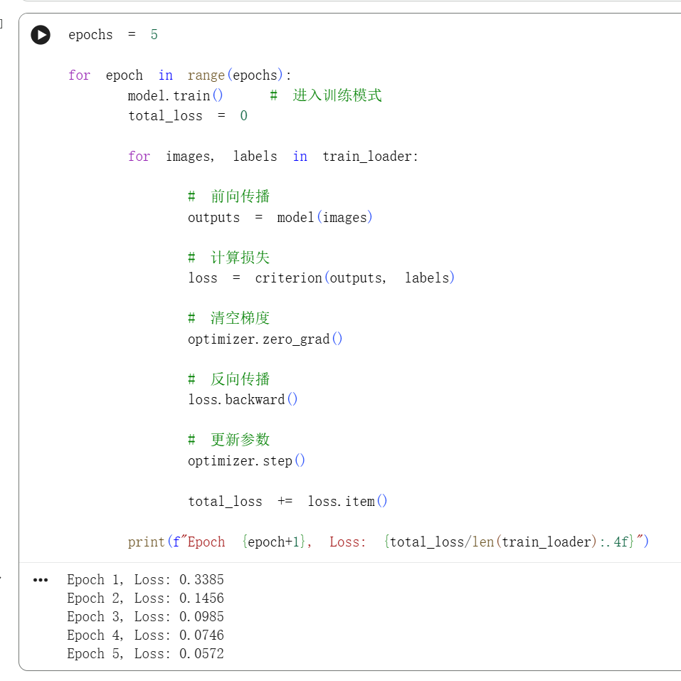
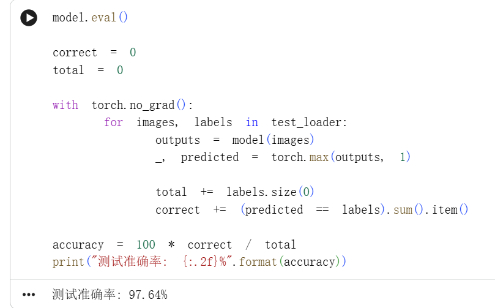
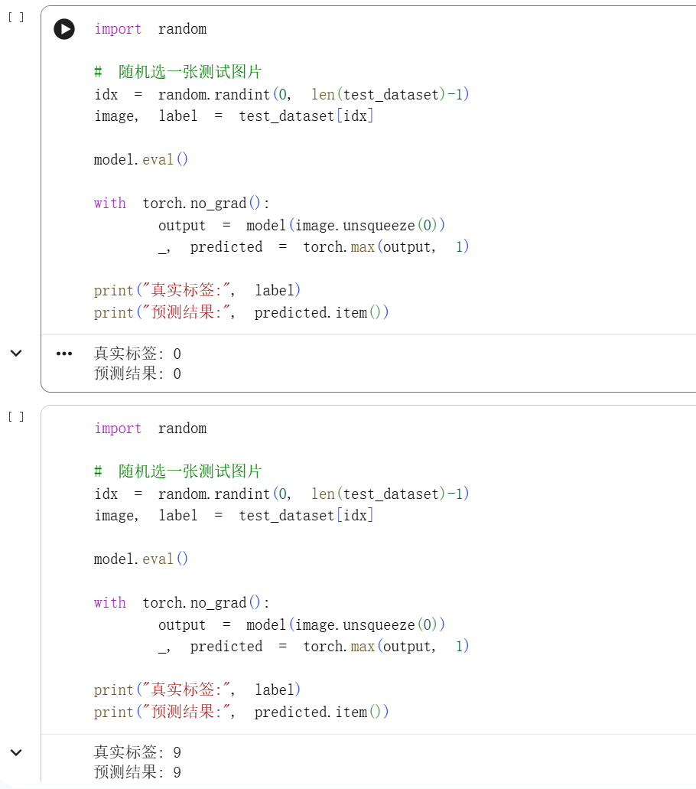

 # Week 2 - MNIST Handwritten Digit Recognition

## 📌 本周目标

本周学习目标围绕深度学习训练流程展开，掌握完整的：

Dataset → Model → Loss → Optimizer → Training Loop

核心问题包括：

- 什么是 Tensor？
- 什么是 Autograd（自动求导）？
- 如何构建一个完整的训练流程？
- 如何保存与加载模型？
- 如何提升模型性能至 95%+ 准确率？

## 核心概念理解

### 1️⃣ Tensor

Tensor 是 PyTorch 中的基本数据结构，
本质上是带有自动求导能力的多维数组。

相比 NumPy 数组，Tensor 支持：

- GPU 加速
- 自动求导
- 构建计算图

---

### 2️⃣ Autograd（自动求导）

Autograd 是 PyTorch 的核心机制。

当张量设置 `requires_grad=True` 时，
PyTorch 会自动记录所有运算操作，
构建计算图。

调用：

loss.backward()

即可自动计算所有参数的梯度。

这使得我们无需手动推导复杂导数。

---

## 模型结构

本次任务使用 MNIST 数据集，
构建一个 3 层 MLP 网络：

784 → 128 → 64 → 10

结构包括：

- nn.Linear（全连接层）
- ReLU（非线性激活函数）

示意结构：

Input (28x28)  
↓  
Flatten  
↓  
Linear(784,128)  
↓  
ReLU  
↓  
Linear(128,64)  
↓  
ReLU  
↓  
Linear(64,10)

输出为 10 类数字概率。

---

## 🔄 训练流程

完整训练流程如下：

1. 前向传播
2. 计算 Loss（CrossEntropyLoss）
3. optimizer.zero_grad()
4. loss.backward()
5. optimizer.step()

该流程体现了：

Dataset → Model → Loss → Optimizer → Loop 的完整闭环。

---

## 📊 实验结果

### 测试准确率

最终在测试集上达到：

Accuracy > 95%

### 损失变化

### 准确率

---

## 💾 模型保存与加载

训练完成后：

torch.save(model.state_dict(), "model.pth")

在新的脚本中：

model.load_state_dict(torch.load("model.pth"))
model.eval()

实现随机读取图片进行预测。

---

## 📚 学习心得

本周最大的收获是理解了完整训练流程。

- 数据如何进入模型
- 梯度如何自动计算
- 参数如何更新
- 为什么需要 zero_grad()
- 为什么要 model.eval()

在调试过程中，我遇到：

- 训练准确率不提升（学习率问题）
- 忘记 zero_grad 导致梯度累积
- 未使用 eval() 导致测试不稳定

本周任务让我真正掌握了
从数据到模型再到部署的完整流程。
